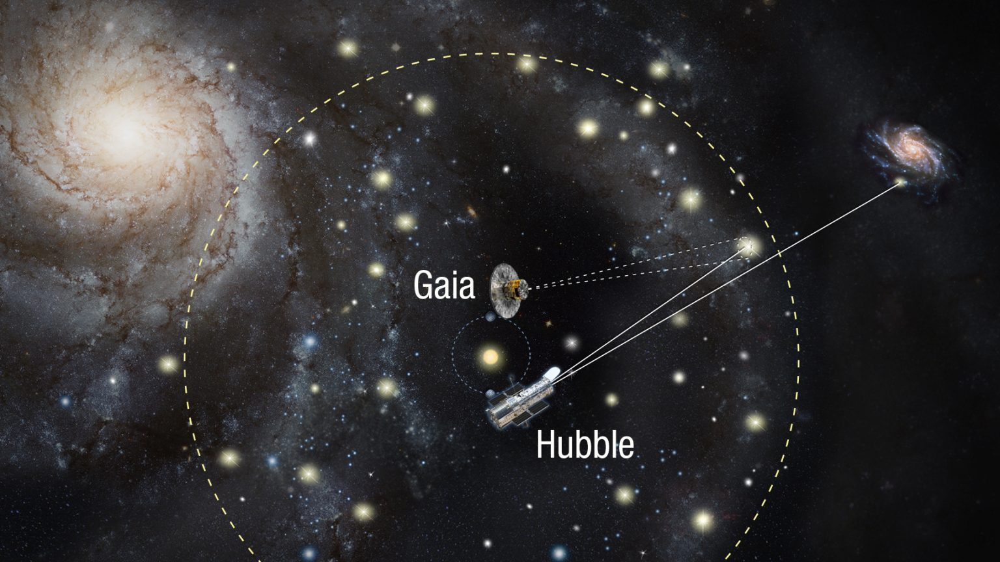
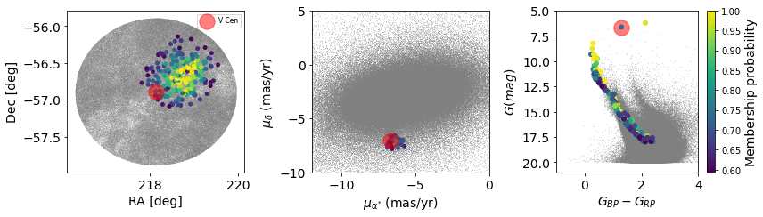

H1PStars is a project that aims to improve our understanding of the expansion of the universe. To achieve this goal, the group [...]. The objective of this page is to concentrate in a single place, all the codes that have been developed to achieve this ambitious task. More information about the group members, publications and open positions in the group can be found [here](https://www.epfl.ch/labs/scd/). 

* TOC
{:toc}

## Codes, data products and associated papers 

### Radial velocities (GE-CeRVS)

Code and small explanation.

GE-CeRVS Data release 1 (Link to data)

GE-CeRVS  (Link to paper)

**Authors and contact support:**

Shreeya

[Giordano](mailto:giordano.viviani@epfl.ch?subject=[GitHub]%20Source%20Han%20Sans) 

Richard

### Distance ladder and Hubble constant
[Code](https://github.com/bastian-lengen-epfl/DistanceLadder) and small explanation.

(Link to paper)

**Authors and contact support:**

[Bastian](mailto:bastianlengen@gmail.com?subject=[GitHub]%20Source%20Han%20Sans) 

### Cluster Cepheids  
[Code](https://github.com/MCruzReyes/H1PSTARS) and small explanation.

Calibration of (Link to paper)

Cluster Cepheids (Link to data)

**Authors and contact support:**
 

[Mauricio](mailto:mauricio.cruzre@gmail.com?subject=[GitHub]%20Source%20Han%20Sans)

